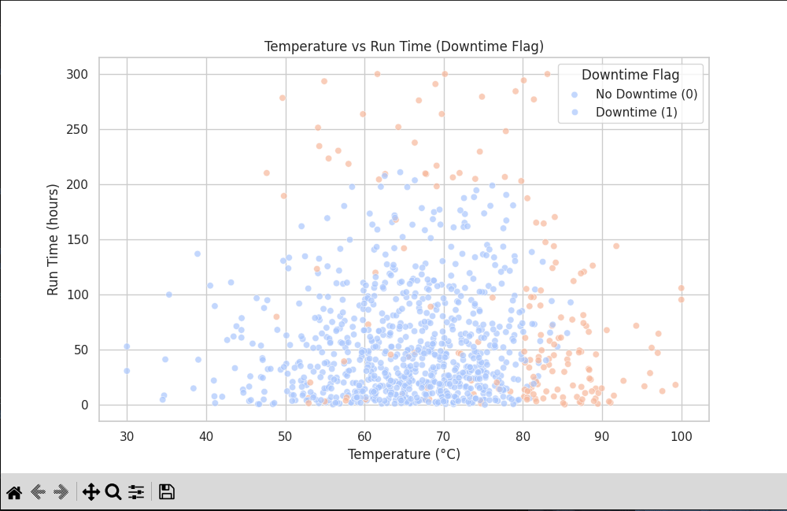
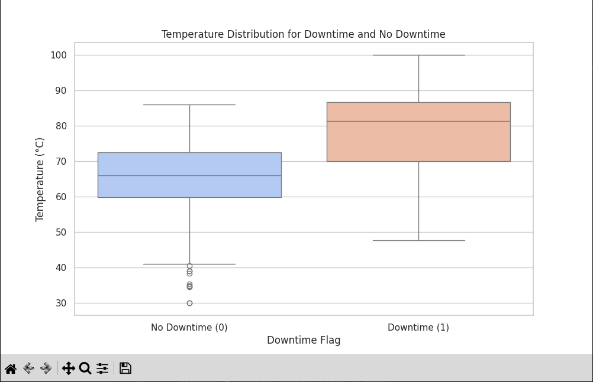
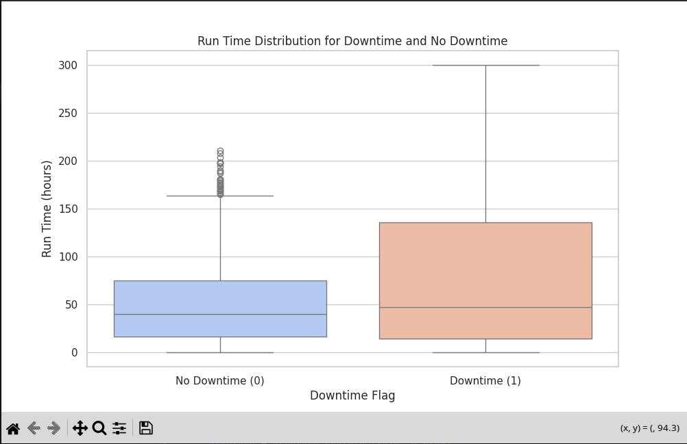
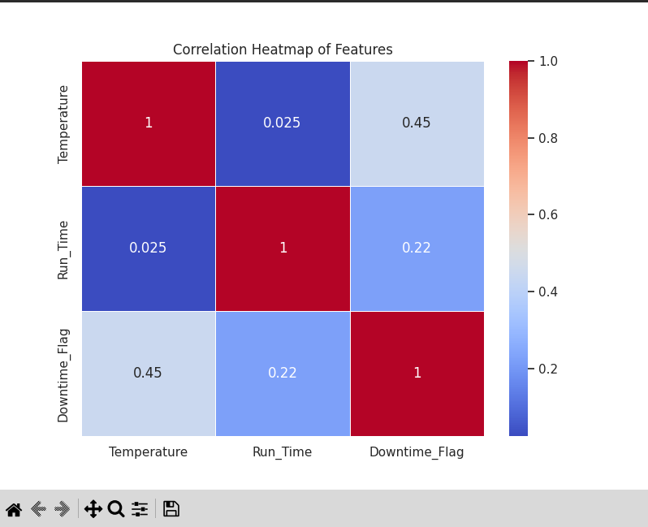
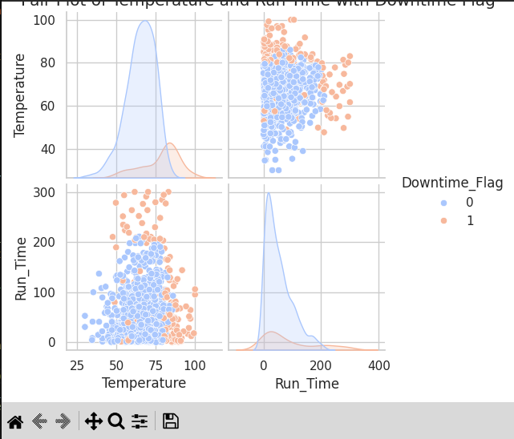

# About the Dataset
The dataset is generated ( synthetic data ), contains all the required columns

## Scattered plot

## Temperature distribution

## Runtime distributtion

## Heatmap

## SNS plot

